<a href="https://github.com/simonwinther">
  <picture>
    <source
      media="(prefers-color-scheme: dark)"
      srcset="./figures/banner.svg"
    >
    <source
      media="(prefers-color-scheme: light)"
      srcset="./figures/banner-light.svg"
    >
    
  </picture>
</a>

 

### Computer Scientist from Denmark
#### Machine Learning · Deep Learning · SWE

  <em>
I like working on machine learning, deep learning, medical AI, and practical software projects.
  </em>

 

 
 

---

## About

<a href="https://github.com/simonwinther">
  <picture>
    <source
      media="(prefers-color-scheme: dark)"
      srcset="./figures/code-card.svg"
    >
    <source
      media="(prefers-color-scheme: light)"
      srcset="./figures/code-card-light.svg"
    >
    
  </picture>
</a>

I’m studying Computer Science and I’m mostly interested in machine learning, deep learning, and medical AI.

I like building things, experimenting with models, and improving my development setup. Most of my work is around neural networks, model training, Python, PyTorch, and small software projects.

I use Arch Linux with Hyprland, Neovim, and Ghostty. You can check my [dotfiles](https://github.com/simonwinther/dotfiles) if you want to see more about my setup. I do spend too much time on dotfiles and tinkering with it because I just find it enjoyable to try and optimize the way I work. So that's why you may see a lot of projects opiniated to my own workstation.

 

---

## Projects

All of my projects are available on my GitHub profile. I use my repositories as a place to experiment and learn around the topics I care about.

---

 
<strong>GitHub Metrics</strong>

 

<table width="100%">
  <tr>
    <td width="50%" align="center">
      <a href="https://next.ossinsight.io/analyze/simonwinther">
        <picture>
          <source
            media="(prefers-color-scheme: dark)"
            srcset="https://next.ossinsight.io/widgets/official/compose-user-dashboard-stats/thumbnail.png?user_id=20711558&image_size=auto&color_scheme=dark"
          >
          <source
            media="(prefers-color-scheme: light)"
            srcset="https://next.ossinsight.io/widgets/official/compose-user-dashboard-stats/thumbnail.png?user_id=20711558&image_size=auto&color_scheme=light"
          >
          
        </picture>
      </a>
    </td>
    <td width="50%" align="center">
      <a href="https://next.ossinsight.io/analyze/simonwinther">
        <picture>
          <source
            media="(prefers-color-scheme: dark)"
            srcset="https://next.ossinsight.io/widgets/official/compose-currently-working-on/thumbnail.png?user_id=20711558&activity_type=all&image_size=auto&color_scheme=dark"
          >
          <source
            media="(prefers-color-scheme: light)"
            srcset="https://next.ossinsight.io/widgets/official/compose-currently-working-on/thumbnail.png?user_id=20711558&activity_type=all&image_size=auto&color_scheme=light"
          >
          
        </picture>
      </a>
    </td>
  </tr>
  <tr>
    <td width="50%" align="center">
      <picture>
        <source
          media="(prefers-color-scheme: dark)"
          srcset="https://github-readme-stats.vercel.app/api?username=simonwinther&show_icons=true&theme=tokyonight&hide_border=true&title_color=7aa2f7&icon_color=bb9af7&text_color=c0caf5&bg_color=1a1b26"
        >
        <source
          media="(prefers-color-scheme: light)"
          srcset="https://github-readme-stats.vercel.app/api?username=simonwinther&show_icons=true&theme=default&hide_border=true&title_color=0969da&icon_color=8250df&text_color=24292f&bg_color=ffffff"
        >
        
      </picture>
    </td>
    <td width="50%" align="center">
      <picture>
        <source
          media="(prefers-color-scheme: dark)"
          srcset="https://github-readme-stats.vercel.app/api/top-langs/?username=simonwinther&layout=compact&theme=tokyonight&hide_border=true&title_color=7aa2f7&text_color=9ece6a&icon_color=bb9af7&bg_color=1a1b26&hide=HTML,CSS"
        >
        <source
          media="(prefers-color-scheme: light)"
          srcset="https://github-readme-stats.vercel.app/api/top-langs/?username=simonwinther&layout=compact&theme=default&hide_border=true&title_color=0969da&text_color=24292f&icon_color=8250df&bg_color=ffffff&hide=HTML,CSS"
        >
        
      </picture>
    </td>
  </tr>
</table>

  <picture>
    <source
      media="(prefers-color-scheme: dark)"
      srcset="https://github-readme-activity-graph.vercel.app/graph?username=simonwinther&theme=tokyo-night&hide_border=true&color=7aa2f7&height=300"
    >
    <source
      media="(prefers-color-scheme: light)"
      srcset="https://github-readme-activity-graph.vercel.app/graph?username=simonwinther&theme=tokyo-day&hide_border=true&height=300"
    >
    
  </picture>

---

  
<strong>More Metrics</strong>

 

<table>
  <tr>
    <td width="50%" align="center">
      
    </td>
    <td width="50%" align="center">
      
    </td>
  </tr>
</table>

---

